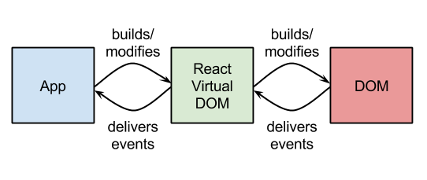
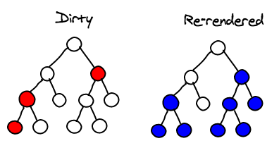

<!-- .slide: class="first-slide"  sfeir-level="1"  sfeir-techno="" -->

# React - 200

# Welcome to SFEIR SchoolReact


##==##
<!-- .slide: -->

# React - Redux


Welcome to SfeirSchoolReact - Redux

~~~~


##==##
<!-- .slide:-->

WIFI : SFEIRGUEST
MDP : GUEST$2014


##==##
<!-- .slide:-->


Wolfgang Goedel
Head of Engineering - Factory Paris
@wgoedel
goedel.w@sfeir.com


# Presentation


##==##
<!-- .slide:-->


Rudy Weber
Front-End Developer
@rudy_weber
weber.r@sfeir.com


# Presentation


##==##
<!-- .slide: class="speaker-slide" -->

# Présentation

<!-- Please choose for each image between speaker or company -->


##
### Romain Torond
Developer & Team leader
@rtorond
torond.r@sfeir.com

##==##
<!-- .slide: class="speaker-slide" -->

# Présentation

<!-- Please choose for each image between speaker or company -->


##
### Stéphane Eintrazi
Developer
eintrazi.s@sfeir.com

##==##
<!-- .slide:-->

# Presentation


Please introduce yourselves!

...and sign the attendance sheet(mandatory)


##==##
<!-- .slide: class="with-code" -->

these slides


```
http://bit.ly/sfeir-school-react
copy them, they may help you

```


##==##
<!-- .slide: class="with-code" -->

exercise repository


```
https://github.com/Sfeir/sfeirschool-react
clone the typescript branch nowgit clone -b typescript-ftw ...

```


##==##
<!-- .slide: class="with-code" -->

```
  $ npm install
  $ npm start

http://localhost:8080/

```


exercise repository


##==##
<!-- .slide:-->


##==##
<!-- .slide:-->

what we will do


Explore key concepts of ReactI will show slides and do some live coding

Practice with hands-on exercisesYou will code, I will help

Breaks when appropriateHave lunch, play babyfoot


##==##
<!-- .slide:-->

# Hello world...


##==##
<!-- .slide:-->

demo 01the problem statement


Hello world...


Notes:
- static HTML - an update function (vanilla)

- add React -> declarative


##==##
<!-- .slide: class="with-code" -->

```

React manages the view of your application
the V of MVC ?
something completely different ?

With React you describe the Document (html)
e.g. the state of elements at a given time,
and you re-describe it entirely when it should change

React-DOM will take care of creating
and updating the actual DOM efficiently


```


Hello world...


Notes:
- a view library: produce a dom tree with javascript  - render it in the browser (or somewhere else)  - calculate the differences, re-render  - render something completely different (native, music ?)


##==##
<!-- .slide:-->

Virtual DOM




##==##
<!-- .slide:-->

# Hello JSX


##==##
<!-- .slide:-->

Hello JSX


demo 01 bisfundamental tooling


Notes:
transform jsbin to use JSX


##==##
<!-- .slide: class="with-code" -->


```

const elements = <h1>Hello JSX</h1>;

function testResult(condition) {
  if (condition) {
    return <div>Yeah, it's true</div>;
  } else {
    return <div>No, it's false</div>;
  }
}

```

Hello JSX


Notes:
expressions

you can bind them

you can return them


##==##
<!-- .slide: class="with-code" -->


```

function wrapWithHeader(elmt) {
  return (
    <header>
      {elmt}
    </header>
  );
}

return wrapWithHeader(<h1>Hello JSX</h1>);


```

Hello JSX


Notes:
you can receive them as parameter


##==##
<!-- .slide: class="with-code" -->


```

const el4 = (
  <div>the response is { 2 * 3 * 7 }</div>
);

const big = (message) => (
  <h1>{ message.toUpperCase() }</h1>
);

const weird = (
  <strong>{ <small> Well... </small> }</strong>
);

```

Hello JSX


Notes:
interpolate any JS expression

(even other JSX if you want)


##==##
<!-- .slide: class="with-code" -->


```

const image = (
  </img>
);

const input = (
  <input tabIndex="1" type="text" value={value} />
);

const invalid = (
  <p>first paragraph</p>
  <p>second paragraph</p>
);


```

Hello JSX


Notes:
attributes are strings in "" or arbitrary JS expressions

empty tags are always closed (it's XHTML ;)

a JSX expression must have a root tag (because it's an expression)


##==##
<!-- .slide: class="with-code" -->


```

const valid = [
  <p>first paragraph</p>,
  <p>second paragraph</p>
];

const fragment = (
  <>
       <p>first paragraph</p>
    <p>second paragraph</p>
  </>
);


```

Hello JSX


Notes:
attributes are strings in "" or arbitrary JS expressions

empty tags are always closed (it's XHTML ;)

a JSX expression must have a root tag (because it's an expression)


##==##
<!-- .slide:-->


JavaScript with some XML like syntax

translates to simple expressions (object graphs)

it is not a template language

it is not compiled (like Angular or Vue templates)

why not template literals ?


Hello JSX


##==##
<!-- .slide:-->

# fundamentals :
components


Notes:
⇒ demo: transformer le jsbin en fonction


##==##
<!-- .slide: class="with-code" -->

```
UI = f(state)


```

components


##==##
<!-- .slide: class="with-code" -->

```
UI = f(state)

element = Component(props)


```


components


##==##
<!-- .slide: class="with-code" -->

```
UI = f(state)

element = Component(props)

Component : (props) => Node

type Node = Element | Fragment | string | null | Node[]


```


components


##==##
<!-- .slide:-->


components


demo 01 tera very simple app


Notes:
@jsbin


extract JSX in a function App- pass a propertyCongrats: this is your first React Component :)


##==##
<!-- .slide:-->


let's write a real application...


##==##
<!-- .slide:-->


… but before you may need to disable the “safe write” of your IDE


https://parceljs.org/hmr.html#safe-write


Notes:
The Hot Module Replacement does not works every times. This is due to the “safe write” enabled by default.


##==##
<!-- .slide:-->

Exercise 01: hands on


JSX - component functions - props


1


create two function components: Header and Card
use provided html templates as blueprint
don't forget that class in html is className in JSX
don't forget to import the logo source

pass MESSAGE declared in App to Card as property
display it in Card

find out how to express style in JSX


Notes:
LIVE CODING


##==##
<!-- .slide:-->

SOLUTION...


##==##
<!-- .slide:-->

# fundamentals :
component trees
properties & children


##==##
<!-- .slide:-->

component trees


a
classic todo app


##==##
<!-- .slide:-->


properties are being passed from parents to children


filter


todo


props


all todos,
filter


##==##
<!-- .slide:-->


properties are being passed from parents to children

properties must not be modified by children- they are immutable


filter


todo


props


all todos,
filter


##==##
<!-- .slide:-->


All React components must act like pure functions with respect to their props.


##==##
<!-- .slide:-->


pure function

function sum(a, b) {
  return a + b;
}

always returns the same result for a given set of parameters

does not modify its parameters, does not have semantical side effects


impure function

const fee = 0.5;

function withdraw(account, x) {  account.total -= x + fee;}

modifies its parameters and/or depends on external context


props


##==##
<!-- .slide: class="with-code"  class="with-code" -->

composition - children


```
<Container>
  <Row>
    <Col md="4">
      <nav>...</nav>
      <aside>...</aside>
    </Col>
    <Col md="8">
      <main>...</main>
      <section>...</section>
    </Col>
  </Row>
</Container>

```

components receive their "children" as property children


```
const Container = (props) => (
  <div className="container">
    {props.children}
  </div>
);

const Row = (props) => (
  <div className="row">
    {props.children}
  </div>
);

const Col = (props) => (
  ...
);

```

##==##
<!-- .slide: class="with-code"  class="with-code" -->


```
<MyNav
  left={}
  right={
    <ul>
      <li><a href="...">...</a></li>
      <li><a href="...">...</a></li>
    </ul>
  }
/>

```

...but they might as well get components via attributes


```
const MyNav = (props) => (
  <nav>
    <div className="pull-left">
      {props.left}
    </div>
    <div className="pull-right">
      {props.right}
    </div>
  </nav>
);

```

remember: you are manipulating JavaScript expressions


composition - children


##==##
<!-- .slide: class="with-code" -->

```

function components are lightweight
there is no sensible performance penalty
they are just function calls

don't hesitate to decompose your components into smaller sub-components,just as if you decompose functions into smaller functions


```

composition


##==##
<!-- .slide:-->

Exercise 2: component tree


divide et impera


2


decompose the PersonCard component
provide randomPerson as property
replace static information with person properties

reuse Card modified to accept children
define in Card.js sub-components of a Card :
(Image, Title, Info)
use those sub-components in PersonCard
there should not remain any style information left in Person


Notes:
LIVE CODING


##==##
<!-- .slide:-->

SOLUTION...


##==##
<!-- .slide:-->

# state


##==##
<!-- .slide: class="with-code"  class="with-code" -->

component flavours


```
const Hello = ({ name }) => (
  <h1>Hello, {name}</h1>
);


```

```
class Hello extends React.Component {
  render() {
    return (
      <h1>Hello, {this.props.name}</h1>
    );
  }
}


```

function component


class component


##==##
<!-- .slide: class="with-code"  class="with-code" -->

component flavours


```
const Button = ({ clickCount }) => (
  <button>
clicked {clickCount} times
  </button>
);


```

```
class Button extends React.Component {
  constructor(props) {
    super(props);
    this.state = {
      clickCount: 0
    };
  }

  render() {
    return (
      <button>
        clicked {this.state.clickCount} times
      </button>
    );
  }
}


```

a class instance can keep state...


##==##
<!-- .slide: class="with-code"  class="with-code" -->

component flavours


```
const Button = ({ clickCount }) => (
  <button>
clicked {clickCount} times
  </button>
);


```

```
class Button extends React.Component {
  constructor(props) {
    super(props);
    this.state = {
      clickCount: 0
    };
  }

  render() {
    return (
      <button>
        clicked {this.state.clickCount} times
      </button>
    );
  }
}


```

a class instance can keep state...
but why is state an object ?


##==##
<!-- .slide:-->


and how do you change state ?


##==##
<!-- .slide:-->

# events


##==##
<!-- .slide: class="with-code"  class="with-code" -->

handling events


```
<script>
  function doIt() {
    console.log('did it');
    // this?
  }
</script>
<button onclick="doIt()">
  do it the old way !
</button>

```

```
const Action = () => {
  const doIt = () => {
    console.log('did it');
    // this?
  }
  return (
    <button onClick={doIt}>
      do it with React !
    </button>
  )
}

```

DOM
event names are lowercase
string is evaluated (what's the context?)


React
names are camelCase
functions are called in global context like pure callbacks


Notes:
show setState with a function

explain async nature of setState


##==##
<!-- .slide: class="with-code"  class="with-code" -->


```
<script>
  function doIt() {
    console.log('did it');
    return false;
  }
</script>
<a href="#" onclick="doIt()">
  do it the old way !
</a>

```

```
const Action = () => {
  function doIt(e) {
    e.preventDefault();
    console.log('did it');
  }
  return (
    <a href="#" onClick={doIt}>
      do it with React !
    </a>
  )
}

```

DOM
prevent default behaviour by returning false


React
preventDefault() must be called explicitly


handling events


Notes:
show setState with a function

explain async nature of setState


##==##
<!-- .slide:-->


SyntheticEvent

follows W3C specification (same API)
normalises browser inconsistencies

In React there is no use for imperative APIs such as addEventListener.
Event handlers are declared directly on the JSX tag
=> they are passed like callbacks to a function


handling events


Notes:
show setState with a function

explain async nature of setState


##==##
<!-- .slide:-->


ok, great!
but how do you change state now?


##==##
<!-- .slide: class="with-code" -->


```
class Button extends React.Component {
  constructor(props) {
    super(props);
    this.state = {
      clickCount: 0,
      foo: "bar"
    };
  }

  render() {
    return (
      <button onClick={
        () => this.setState({
          clickCount: this.state.clickCount+1
        })
      }>
        clicked {this.state.clickCount} times
      </button>
    );
  }
}


```

setState


setState updates the state and triggers a re-render of the component

setState patches the existing state


##==##
<!-- .slide:-->

more about state


demo 02


Notes:
show setState with a function

explain async nature of setState


##==##
<!-- .slide:-->

setState is asynchronous





Notes:
async setState - batch update


##==##
<!-- .slide:-->

events and state - recap


event-handlers are just functions (callbacks)
virtual HTMLElement trigger SyntheticEvents
other components trigger whatever they want
inline callbacks are OK, except when they are not

state updates are asynchronous
use state projection functions when depending on current state

JavaScript classes are ...


Notes:
use events.jsx


##==##
<!-- .slide:-->

Exercise 03: state and clicks


remember it


3


change the PersonCarousel into a class component

implement a Person carousel
cycle through the people array
use the utility functions in utils.js

use setState with a projection function
setState :: (oldState, props) => partial<newState>


Notes:
LIVE CODING


##==##
<!-- .slide:-->

SOLUTION...


##==##
<!-- .slide:-->

handling events


Event handlers are just properties

Event arguments take the opposite direction of properties


app state


todos, filter


filter


todo


onFilterChange(...)


onTodoDone(todo)


onTodoDone(todo)


Notes:
use events.jsx


##==##
<!-- .slide:-->

ONE MORE THING...


##==##
<!-- .slide:-->


Hooks


##==##
<!-- .slide:-->

hooks


from the docs:

Hooks are a new feature that lets you use state and other React features without writing a class

Classes confuse both people and machines

There are no plans to remove classes from React.

Hooks don’t replace your knowledge of React concepts. Instead, Hooks provide a more direct API to the React concepts you already know: props, state, context, refs, and lifecycle. As we will show later, Hooks also offer a new powerful way to combine them.


Notes:
use events.jsx


##==##
<!-- .slide:-->

hooks


demo 02 bis


Notes:
show setState with a function

explain async nature of setState


##==##
<!-- .slide:-->

Exercise 03 bis: useState hook


back to functions


3


change the PersonCarousel back into a function component

use useState to keep track of the current index

keep the projection function
setState :: oldState => newState
it is returned by the range util


Notes:
LIVE CODING


##==##
<!-- .slide:-->

SOLUTION...


##==##
<!-- .slide:-->

# conditionals, lists
and more about children


##==##
<!-- .slide: class="with-code" -->


```
const Welcome = ({ username }) => (
  <h1>Welcome back, {username}</h1>
);

const Login = ({ onLogin }) => (
  <h1>Please <button onClick={onLogin}>login</button></h1>
);

const Header = ({ username, login }) => {
  if (username) {
    return <Welcome username={username} />;
  } else {
    return <Login onLogin={login} />;
  }
}

```

use
if-then-else
or
switch


conditionals


Notes:
use events.jsx


##==##
<!-- .slide: class="with-code" -->


```
const Header = ({ username, login }) => {
  let welcome;
  if (username) {
    welcome = <Welcome username={username} />;
  } else {
    welcome = <Login onLogin={login} />;
  }

  return (
    <header>
      
      {welcome}
    </header>
  );
}

```

or a
variable


conditionals


Notes:
use events.jsx


##==##
<!-- .slide: class="with-code" -->


```


const Inbox = ({ messages, unread }) => (
  <div>
    {unread.length > 0 &&
      <header>You have {unread.length} unread messages</header>
    }
    <main>
      {messages}
    </main>
  </div>
);

```

or a
logical operator

React ignores false and null


conditionals


Notes:
use events.jsx


##==##
<!-- .slide: class="with-code" -->


```

const Inbox = ({ messages, unread }) => (
  <div>
    {unread.length > 0 ? (
      <header>You have {unread.length} unread messages</header>
    ) : (
      <header>Nothing new for now</header>
    )}
    <main>
      {messages}
    </main>
  </div>
);

```

or the
ternary operator
(it's an expression!)


conditionals


Notes:
use events.jsx


##==##
<!-- .slide:-->

conditionals


Surprise !

they are just JavaScript expressions


No ng-if, v-if, *ngIf or {{#if…}} to remember


Notes:
use events.jsx


##==##
<!-- .slide: class="with-code" -->


same for lists

JSX accepts arrays of elements

the rest is
(functional)
JavaScript


```

const Inbox = ({ messages, unread }) => (
  <div>
    {unread.length > 0 &&
      <header>{unread.length} unread</header>
    }
    <main>
      {messages.map(message => (
        <Message {...message} />
      ))}
    </main>
  </div>
);


```

lists


Notes:
use events.jsx


##==##
<!-- .slide: class="with-code" -->


...but


```


Warning: Each child in an array or iterator should have a unique "key" prop. Check the render method of `Inbox`. See https://fb.me/react-warning-keys for more information.


```

lists


Notes:
use events.jsx


##==##
<!-- .slide:-->


lists


Notes:
use events.jsx


##==##
<!-- .slide: class="with-code" -->

lists


always add the pseudo-prop "key" when inserting element arrays

key must be unique in the context of the list only

key should derive from the displayed entity(the index is useless - why?)


```

const Inbox = ({ messages, unread }) => (
  <div>
    {unread.length > 0 &&
      <header>{unread.length} unread</header>
    }
    <main>
      {messages.map(message => (
        <Message {...message} key={message.id} />
      ))}
    </main>
  </div>
);


```

Notes:
une exception → children


##==##
<!-- .slide: class="with-code" -->


```
const Tabs = ({ children }) => {
  const [current, setCurrent] = useState(0);
  return (
    <section>
      <header>
        {React.Children.map(children, (child, i) => (
          <Tab
            title={child.props.title}
            onSelect={() => setCurrent(i)} />
        ))}
      </header>
      <main>
        {React.Children.toArray(children)[current]}
      </main>
    </section>
  );
};


```

children


children property is an opaque structure

React.Children utility can be used to traverse the children "collection"

use React.cloneElement if you need to add properties


##==##
<!-- .slide:-->

Exercise 04: lists of persons


4


Change App so you can switch between a List and a Carousel of PersonCards
use the action item in Header to toggle the views
sure, this is normally done with a router… patience…

Create the Carousel component displaying anything you pass as children
there must not remain any reference to PersonCard


repeat yourself


##==##
<!-- .slide:-->

SOLUTION...


##==##
<!-- .slide:-->

# ...recap


##==##
<!-- .slide:-->

React is...


a library to manage the vue
component oriented
UI = f(state)

a simple API (no DSL)
a functional approach to WEB development
just JavaScript


Notes:
use events.jsx


##==##
<!-- .slide:-->


# This was just the beginning ...


# #sfeirschool #react
@sfeir @wgoedel


##==##
<!-- .slide:-->


# This was just the beginning ...


# #sfeirschool #react
@sfeir @wgoedel


##==##
<!-- .slide:-->

# input,
controlled components


##==##
<!-- .slide:-->

demo 03


Controlled components


##==##
<!-- .slide:-->

input - controlled components


state = { value, disabled, … }


state = { value, disabled, … }


Notes:
use events.jsx


##==##
<!-- .slide:-->


sync


state = { value, disabled, … }


state = { value, disabled, … }


input - controlled components


Notes:
use events.jsx


##==##
<!-- .slide:-->


Every piece of knowledge must have a single, unambiguous, authoritative representation within a system
the DRY principle
The Pragmatic Programmer (Andy Hunt, Dave Thomas)


sync


state = { value, disabled, … }


state = { value, disabled, … }


input - controlled components


Notes:
use events.jsx


##==##
<!-- .slide:-->


value, disabled, ...


onChange, ...


component is thesingle source of truth


state = { value, disabled, … }


state = { value, disabled, … }


projection of state


input - controlled components


Notes:
use events.jsx


##==##
<!-- .slide:-->


a word about refs


parent components interact with their children via props
to modify a child, re-render with new props;that's the typical state projection UI = f(state)

sometimes you need to imperatively modify a component outside the typical dataflow
focus() a DOM component, play() a <video>
interact with WebComponents

refs are escape hatcheshttps://reactjs.org/docs/refs-and-the-dom.html


##==##
<!-- .slide: class="with-code" -->


```
class Jukebox extends React.Component {
  audioElmt = React.createRef();

  play() {
    this.audioElmt.current.play();
  }

  render() {
    return <audio ref={this.audioElmt} />;
  }
}


const MyInput = props => {
  const inputRef = useRef();

  execWhenItAppears(() => {
    inputRef.current.focus();
  });

  return <input ref={inputRef} {...props} />;
};


```

refs


refs of DOM components give access to the document object instance - this includes WebComponents

refs of class components give access to their exposed API

you can't ref a function component


##==##
<!-- .slide:-->

Exercice 05: inputs and refs


5


Implement the SearchableList component
manage a query state holding the value of the search input
display the filtered list on change
connect the clear icon

Expose an imperative next method on the Carousel in Player
call it via a ref when the play button is clicked


filter lists, control the carousel


##==##
<!-- .slide:-->

SOLUTION...


##==##
<!-- .slide:-->

# lifecycle and effects


##==##
<!-- .slide:-->


component lifecycle


http://projects.wojtekmaj.pl/react-lifecycle-methods-diagram/


##==##
<!-- .slide:-->


component lifecycle


##==##
<!-- .slide:-->


...but
what about hooks?


##==##
<!-- .slide: class="with-code"  class="with-code" -->


useEffect hook


```

const FromServer = () => {
  useEffect(() => {
    load().then(setData);
  }, []);

  return <Something />;
};

```

```

class FromServer extends React.Component {
  async componentDidMount() {
    const data = await load();
    this.setState({ data });
  }

  render() {
    return <Something />;
  }
}


```

##==##
<!-- .slide: class="with-code"  class="with-code" -->


useEffect hook


```

const FromServer = () => {
  useEffect(() => {
    let set = true;
    load().then(data => {
      if (set) setData(data);
    });
    return () => set = false;
  }, []);

  return <Something />;
};

```

```

class FromServer extends React.Component {
  async componentDidMount() {
    this.setData = true;
    const data = await load();
    if (this.setData === true) {
      this.setState({ data });
    }
  }

  componentWillUnmount() {
    this.setData = false;
  }

  render() {
    return <Something />;
  }
}

```

##==##
<!-- .slide: class="with-code"  class="with-code" -->


useEffect hook


```

const Repeat = () => {
  useEffect(() => {
    const timeoutId = setTimeout(
      () => repeatSomething(),
      100
    );

    return () => clearTimeout(timeoutId);
  });

  return <Something />;
};

```

```

class Repeat extends React.Component {
  componentDidMount() {
    this.intervalId = setInterval(
      () => this.repeatSomething(),
      100
    );
  }

  componentWillUnmount() {
    clearInterval(this.intervalId);
  }

  render() { return <Something />; }
}

```

##==##
<!-- .slide:-->


how to avoid refs?


##==##
<!-- .slide:-->

Exercice 06: lifecycle


6


Contact the API - load people from 'http://localhost:3000/people'
use the loadPeople function in utils

implement the play button in Player, show the next person every two seconds
lift state up into the player - make Carousel "controlled"
how will you stop the timeout function ?
there must not be any warning when switching back to list


have some side effects


##==##
<!-- .slide:-->

SOLUTION...


##==##
<!-- .slide:-->

# about states


##==##
<!-- .slide:-->

sharing state


in a component architecture, state must be shared at the nearest common ancestor of components using the same state

...this can be quite far away ?


Notes:
use events.jsx


##==##
<!-- .slide:-->

transient UI state


local state of a visual component, with no link to business data


Notes:
use events.jsx


##==##
<!-- .slide:-->

navigation state


state of the URL

"window" you are looking through at your application

easily sharable by just copy/pasting


Notes:
use events.jsx


##==##
<!-- .slide:-->

application state


your application's business data


Notes:
use events.jsx


##==##
<!-- .slide:-->

persistent state


basically data managed by the server


Notes:
use events.jsx


##==##
<!-- .slide:-->

# routing and context


##==##
<!-- .slide:-->

The App should behave like a website
back button, deep links

Problems
How to project URL state in the app
How to avoid that links trigger reloads


SPA et routes


Notes:
use events.jsx


##==##
<!-- .slide:-->

react-router


Simple
Declarative
Just Components

Docs : https://reacttraining.com/react-router


Notes:
use events.jsx


##==##
<!-- .slide: class="with-code"  class="with-code"  class="with-code" -->

<Route />


```
import {
  BrowserRouter as Router,
  Route
} from 'react-router-dom'

<Router>
  <div>
    <Route exact path="/" component={Home}/>
    <Route path="/news" component={NewsFeed}/>
  </div>
</Router>

```

```
<div>
  <Home/>
  <!-- react-empty: 2 -->
</div>

```

```
<div>
  <!-- react-empty: 1 -->
  <NewsFeed/>
</div>

```

Notes:
use events.jsx


##==##
<!-- .slide: class="with-code"  class="with-code" -->

render: func


Route props...


```
<Route path="/songs" render={
  () => (
    <Songs songList={SONGS}/>
  )
}/>

```

exact: bool


```
<Route path="/" exact component={Index}/>

```

Notes:
use events.jsx


##==##
<!-- .slide: class="with-code" -->

… or route props ?


```
<Route path="/movie/:id" render={
  ({
    match: {
      isExact, params, path, url
    },
    history: {
      action, go, goBack, goForward, push, replace
    },
    location: {
      hash, key, pathname, search, state
    }
  }) => (
    <Movie id={params.id}/>
  )
}/>

```

Notes:
use events.jsx


##==##
<!-- .slide: class="with-code" -->

<Switch> et <Redirect>


```
<Switch>
  <Route exact path="/" component={Home} />
  <Route path="/about" component={About} />
  <Route path="/:user" component={User} />
  <Redirect to="/"/>
</Switch>

```

Switch displays the first matching route exclusively


Notes:
use events.jsx


##==##
<!-- .slide: class="with-code" -->

<Link> et <Navlink>


```
<Link to="/home">home</link>

<NavLink
  to="/users"
  activeClassName="selected"
  exact
>
  users
</NavLink>


```

These components render controlled links : no GET request will be made, it's the history API who is in charge.Navlink sets a ‘className’ when the path matches.


Notes:
use events.jsx


##==##
<!-- .slide:-->

Exercice 07: navigation


7


use a router


Add two routes: /player and /list
add a Redirect to /list as default
Use the "render" form of Route so you can pass people as propto Player and SearchableList
Replace the "toggle" in AppBar at least with two NavLinks
or better with two ActionItems changing routes (see Route without path)

Bonus: Add a /person/:id route and a new Person component
Person should receive a person via props and display it
Person should display "not found" if the person does not exist


##==##
<!-- .slide:-->

SOLUTION...


##==##
<!-- .slide: class="with-code"  class="with-code"  class="with-code" -->

How to communicate between components with no direct parent-child relationship without polluting intermediate props ?


Context


```
{...{prop, callback}}

```

```
{...{prop, callback}}

```

```
{...{prop, callback}}

```

Notes:
use events.jsx


##==##
<!-- .slide: class="with-code" -->

"Context provides a way to pass data through the component tree without having to pass props down manually at every level" - React Doc


Context


```
const {Provider, Consumer} = React.createContext(defaultValue);

```

Provider will hold the value specified in createContext and make it accessible to all of its children.
Consumer will read the context value from its closest Provider.


Notes:
use events.jsx


##==##
<!-- .slide: class="with-code"  class="with-code" -->


Context


```
import MyContext from "../contexts/MyContext";

class A extends React.Component {
  render() {
    return (
	<MyContext.Provider
  value={contextValue}>
	  {this.props.children}
	</MyContext.Provider>
    );
  }
}

```

```
import MyContext from "../contexts/MyContext";

class D extends React.Component {
  render() {
    return (
	<MyContext.Consumer>
	  {contextValue => {
	    // has access to the contextValue
  }}
	</MyContext.Consumer>
    );
  }
}

```

##==##
<!-- .slide:-->


Context


When should you use Context ?

Themes
i18n
Authentication
…

You may want to use Context for shared behaviours across your application,
just like a "global state",

or you can use Context to "inject" services - and provide mocks when testing


##==##
<!-- .slide:-->

Exercice 08: context


8


another way of sharing


Share the people list through a PeopleContext
wrap Player and SearchableList with people from context
simplify the Routes
change Person to use the context to get its person data

Use different ways of accessing the Context
use the Consumer
use the useContext hook


##==##
<!-- .slide:-->

solution...


##==##
<!-- .slide:-->


# Hang on...take control of your state


# #sfeirschool #react
@sfeir @wgoedel


##==##
<!-- .slide:-->

# reuse logic


##==##
<!-- .slide:-->

# render props
what if "children" was a function


##==##
<!-- .slide:-->

# higher order components


##==##
<!-- .slide:-->

# custom hooks


##==##
<!-- .slide:-->

# ...forms


##==##
<!-- .slide: class="with-code" -->


```
class MyForm extends Component {
  state = {
    value: this.props.initialValue
  };

  handleChange = event => {
    this.setState({
      value: event.target.value
    });
  };

  render() {
    return (
      <input
        value={this.state.value}
        onChange={this.handleChange}
      />
    );
  }
}

```

forms in React docs


##==##
<!-- .slide: class="with-code" -->


```
const MyForm = ({ initialValue }) => {
  const [value, setValue] = useState(initialValue);
  const handleChange = event =>
    setValue(event.target.value);

  return (
    <input
      value={value}
      onChange={handleChange}
    />
  );
}

```

forms in React docs


##==##
<!-- .slide: class="with-code" -->


```
class MyForm extends Component {
  // init

  handleChange = event => {
    this.setState({
      [event.target.name]: event.target.value
    });
  };

  render() {
    return (
      <>
        <input
          name="firstname"
          value={this.state.firstname}
          onChange={this.handleChange}
        />
        <input
          name="lastname"
          value={this.state.lastname}
          onChange={this.handleChange}
        />
      </>
    );
  }
}

```

forms in React docs


##==##
<!-- .slide: class="with-code" -->


```
const MyForm = ({ initialValue }) => {
  const [values, setValues] = useState(initialValue);
  const handleChange = event => setValues({
    ...values,
    [event.target.name]: event.target.value
  });

  return (
    <>
      <input
        name="firstname"
        value={values.firstname}
        onChange={handleChange}     />
      <input
        name="lastname"
        value={values.lastname}
        onChange={handleChange}
      />
    </>
  );
}

```

forms in React docs


##==##
<!-- .slide:-->

# ...there are no "react-forms" :(


##==##
<!-- .slide:-->

forms


A form component typically should manage:
the edited model
input validation
its state (valid, disabled, dirty, ...)

We already know everything to do this...
Should we implement it?


Notes:
use events.jsx


##==##
<!-- .slide:-->

Exercice 09: reuse form logic


9


formik and custom hooks


Implement PersonForm using the Formik library
use the Formik component or withFormik HOC
use Field components or useField hooks

Expose a people service through a custom usePeople hook


##==##
<!-- .slide:-->

SOLUTION...


##==##
<!-- .slide:-->


# Thank you


# #sfeirschool #react
@sfeir @wgoedel goedel.w@sfeir.com


